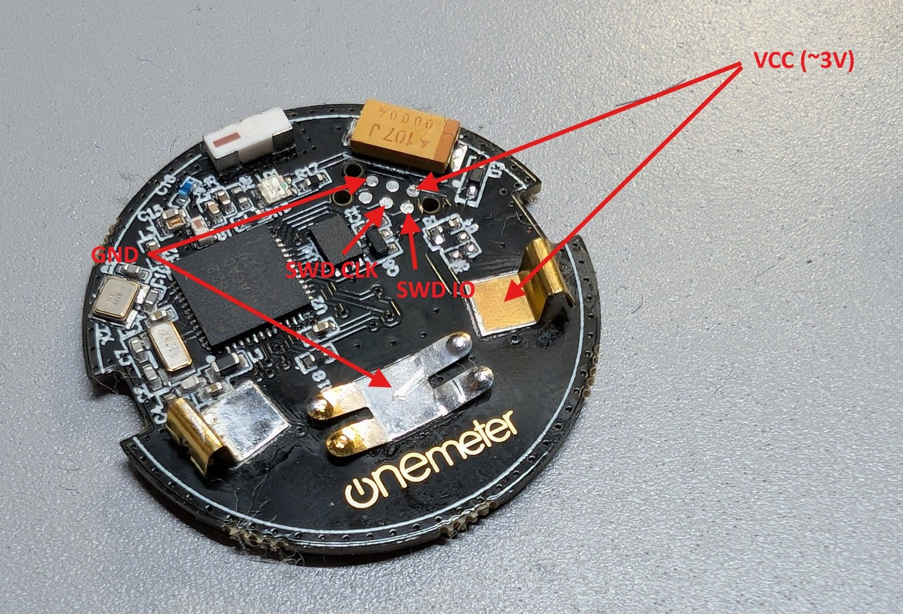

# Extracting credentials from your OneMeter device

> **⚠️ Untested**
>
> This guide and the helper script `extract_credentials.py` have been
> derived from reverse-engineering one specific OneMeter device's
> firmware, but **the script itself hasn't been run end-to-end against
> a live device yet** (the SWD rig was disconnected when the script
> was written). The flash offsets and bypass-gadget address below are
> believed correct for the analysed firmware but may differ on yours.
> If something doesn't match, please open an issue on the repository
> with the device's firmware version, what you got back, and what you
> expected.

This integration needs two 16-byte secrets from your OneMeter device:

| What | Why |
|---|---|
| **mobKey** | The AES-128 key the device uses to encrypt its BLE traffic. |
| **IV**     | The initial cleartext block that, encrypted with mobKey, produces the keystream the device XORs payloads with. |

Both were written into the device's internal flash by the OneMeter
mobile app's *registration* flow when you first paired the device with
the OneMeter cloud. They are **per-device** — your neighbour's mobKey
won't work on yours. They aren't reachable over BLE; the only way to
recover them is to read them out over SWD.

The OneMeter chip (Nordic nRF51822) has factory-set code-readout
protection (APPROTECT) enabled. That makes the flash unreadable
through a normal SWD memory read. There is, however, a well-known
hardware bug in this chip family that lets you leak protected flash
one word at a time by single-stepping through an existing load
instruction in unprotected flash. The helper script automates that
read for the mobKey and IV.

---

## What you need

**Hardware**
- The OneMeter device, opened so the nRF51822's SWD pads (SWDIO,
  SWCLK, GND, optionally VDD) are accessible.
- A SWD programmer that OpenOCD supports — CMSIS-DAP, ST-Link v2,
  J-Link, Black Magic Probe.
- Wire / soldering / probe-clip access to the SWD pads.

**Software**
- [OpenOCD](https://openocd.org/) installed on your computer.
- Python 3.9 or newer (stdlib only — no `pip install` required for the
  helper script itself).

**Skill**
- Comfort with a soldering iron or fine probes (the pads are tiny).
- Comfort dropping to a terminal and reading error messages.

If you've never done embedded work before, find a friend who has, or
ask in the integration's issue tracker.

---

## Procedure

### 1. Wire up SWD

Open the device. You'll see the nRF51822 on the PCB along with six
small gold pads arranged in a 2 × 3 grid that you can use for SWD.
Their function is:

|              | left           | middle             | right                   |
|---           |---             |---                 |---                      |
| **top row**    | **GND**        | (not identified) | **VCC** (~3 V)          |
| **bottom row** | (not identified) | **SWDCLK** (chip pin 23) | **SWDIO** (chip pin 24) |

Photo (top-down view, with the device's USB connector on the left):



Four of the six pads are what you need — the two unlabelled pads in
the table aren't required for the read-out and we haven't identified
them yet. They might be `nRESET`, `SWO`, factory test points, or
something else; if you figure it out, please open an issue.

Connect:

- **GND** on the device → **GND** on your SWD programmer.
- **SWDCLK** on the device → **SWCLK** on the programmer.
- **SWDIO** on the device → **SWDIO** on the programmer.
- **VCC**: optional. The OneMeter is battery-powered (CR2032); if you
  leave the cell in, the device powers itself and you don't need to
  wire VCC at all. If you remove the cell and want the programmer
  to supply target power instead, connect VCC and make sure your
  programmer's target-voltage switch is set to **3.0 V**. Never feed
  target voltage from the programmer while the cell is still in —
  you risk back-feeding the battery.

The pads are small. Solder fly-wires, use a clip-on test fixture, or
hold pogo pins by hand while the script runs — whatever works for you.
A flaky physical connection is the most common cause of unreliable
reads in the next steps.

### 2. Start OpenOCD

In one terminal, run OpenOCD pointing at your programmer interface.
Adjust the `interface/...` line to whatever you have. Common examples:

```sh
# CMSIS-DAP (DAPLink, etc.)
openocd -f interface/cmsis-dap.cfg \
        -c "transport select swd" \
        -c "adapter speed 5" \
        -c "reset_config none" \
        -f target/nrf51.cfg
```

```sh
# ST-Link v2
openocd -f interface/stlink.cfg \
        -c "transport select hla_swd" \
        -f target/nrf51.cfg
```

OpenOCD should print something like `Target voltage: 3.0 V` and
`nrf51.cpu: hardware has 4 breakpoints, 2 watchpoints`. Leave that
running. It listens on telnet port `4444` by default.

If OpenOCD complains it can't see the chip, fix the wiring before
going further. The extractor cannot work around a flaky SWD connection.

### 3. Run the extractor

In another terminal, from this repository:

```sh
python tools/extract_credentials.py
```

The script:
- Connects to OpenOCD's telnet port.
- Issues `reset halt` (puts the CPU in a known state).
- Reads the BLE MAC from FICR (unprotected, sanity-check that you're
  talking to the right chip).
- Uses the CRP-bypass gadget to read 16 bytes at flash `0x0003F024`
  (mobKey) and 16 bytes at `0x0003F034` (IV).
- Resumes the CPU and exits.

A successful run prints something like:

```
================================================================
OneMeter device credentials
================================================================
BLE MAC      : E5:01:36:A0:68:63
DEVICE ID    : 4F03BD65...

mobKey (hex) : f2bec5110dc2097b7623a58524157bd2
IV     (hex) : 43dff996f127364ff58015b0671198dd

Copy the BLE MAC, mobKey, and IV into the integration's config flow.
These bytes are sensitive — treat them like a password.
```

Cross-check the BLE MAC against the sticker on the device (or against
what your phone's BLE scanner shows). If they match, the read is
trustworthy. If they don't, fix that mismatch before touching the
mobKey/IV values.

### 4. Plug the values into the integration

Open Home Assistant → Settings → Devices & Services → "Add
Integration" → OneMeter. The config flow asks for:

- BLE MAC address (paste as printed above)
- mobKey (hex, 32 characters)
- IV (hex, 32 characters)

That's the only configuration step. Polling will start automatically.

---

## Options

The script accepts a few flags for non-default setups:

```
--host HOST            OpenOCD telnet host (default 127.0.0.1)
--port PORT            OpenOCD telnet port (default 4444)
--gadget-pc HEX        Override the bypass-gadget PC (default 0x6d4)
--gadget-reg REG       Override the gadget register name (default r4)
--mobkey-offset HEX    Override the mobKey flash offset (default 0x3f024)
--iv-offset HEX        Override the IV flash offset (default 0x3f034)
--json                 Emit a single JSON object instead of a human report
--output FILE          Also write the JSON output to FILE
--skip-reset           Don't issue 'reset halt' first (use if device already halted)
--no-resume            Leave the CPU halted on exit (debug aid)
```

Exit codes:

| Code | Meaning |
|---:|---|
| 0 | Success, no warnings. |
| 1 | Success, but warnings printed (e.g. flash slot reads as all-0xFF, suggesting offsets may be wrong). |
| 2 | Could not connect to OpenOCD. |
| 3 | FICR read failed — wiring problem. |
| 4 | Bypass-gadget read failed — gadget PC/register probably wrong for this firmware. |

---

## Troubleshooting

### OpenOCD won't connect to the chip

Most often this is wiring. Double-check SWDIO/SWCLK aren't swapped,
that GND is shared between programmer and device, and that VDD is
present (3.0 V or so). Try a slower adapter speed (`-c "adapter speed 1"`).

### FICR read returns all zeros

Means SWD is up but the chip is locked harder than usual. Try a fresh
`reset halt` and re-run.

### mobKey or IV is all 0xFF

The flash slot is unprogrammed. Either the offsets are wrong for your
firmware version, or the device was never registered with the OneMeter
cloud (no mobKey was ever written). If you're sure the device was
once registered, the offsets are most likely the problem — see the
"Finding the offsets manually" section below.

### Bypass-gadget read fails

The default `--gadget-pc 0x6d4 --gadget-reg r4` matches the firmware
revision this integration was built against. Other revisions may have
the gadget at a different address. The general procedure for finding
the right value is documented in detail in the upstream
[nrf51-extractor README](https://github.com/grappeq/nrf51-extractor#step-1--find-the-load-instruction-address);
the short version:

1. Reset and halt the CPU with OpenOCD.
2. Set all registers to a known FICR address (something unprotected,
   readable).
3. Single-step and inspect registers — any one that now holds the
   value at that FICR address is your destination register.
4. Note both the PC value of that instruction and which register
   received the loaded value.
5. Pass those to the extractor via `--gadget-pc` and `--gadget-reg`.

### "I keep getting different values for the same address"

The bypass gadget is single-step-flaky: each read has a small chance
of returning a wrong word. The extractor reads each word twice and
requires the two reads to agree (with up to 3 retries). If even that
fails repeatedly for you, lower your adapter speed
(`-c "adapter speed 1"`) and retry.

---

## Finding the offsets manually

The defaults (`0x3F024` for mobKey, `0x3F034` for IV) are correct for
the firmware revision we analysed. If your device is on a different
firmware, you can find them by dumping the full 256 KB flash and
looking for the AES key block.

The upstream nrf51-extractor (`readout.py`) does the full dump.

A practical heuristic for finding the right offsets once you have the
dump:

- The mobKey and IV live as a contiguous 32-byte region in the device-
  config area of flash (high addresses, near `0x3F000`).
- The same area contains a copy of the device's BLE MAC. Searching
  your dump for the MAC (printed on the OneMeter label) anchors you;
  the AES key + IV are right next to it.
- Both fields are 16 bytes of "looks random" data — entropy makes
  them stand out from the otherwise mostly-zero / mostly-0xFF flash.

Once you've identified them, pass the offsets via `--mobkey-offset`
and `--iv-offset` and re-run the extractor.

---

## What the script does NOT do

- It does not modify the device. No flash writes, no UICR changes.
- It does not unlock APPROTECT permanently or alter the chip's
  security state.
- It does not extract anything beyond the BLE MAC, device ID, mobKey,
  and IV. If you want a full FICR/UICR/peripheral dump, use the
  upstream
  [nrf51-extractor](https://github.com/grappeq/nrf51-extractor)
  directly.

---

## Security note

The mobKey is the key to your device. Anyone who has it can
authenticate to the device and read your meter data. Treat the output
of this script like a password: don't paste it into public chats,
don't commit it to a Git repo, don't share it.

If you suspect a mobKey leaked, the only way to invalidate it is to
factory-reset the device (which on stock firmware requires the
OneMeter cloud being alive — for which this whole integration exists
to work around). There is no host-side mobKey rotation.

---

## References

- Upstream extractor: <https://github.com/grappeq/nrf51-extractor>
- Pen Test Partners writeup of the nRF51 CRP-bypass:
  <https://www.pentestpartners.com/security-blog/nrf51822-code-readout-protection-bypass-a-how-to/>
- Nordic nRF51 series reference manual (for FICR layout): Nordic
  Semiconductor's developer site.
